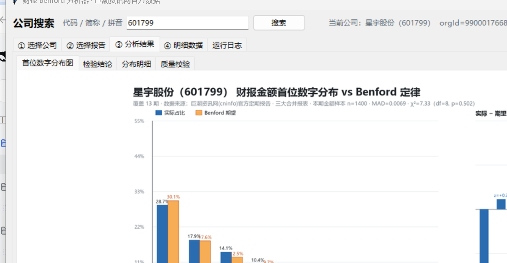
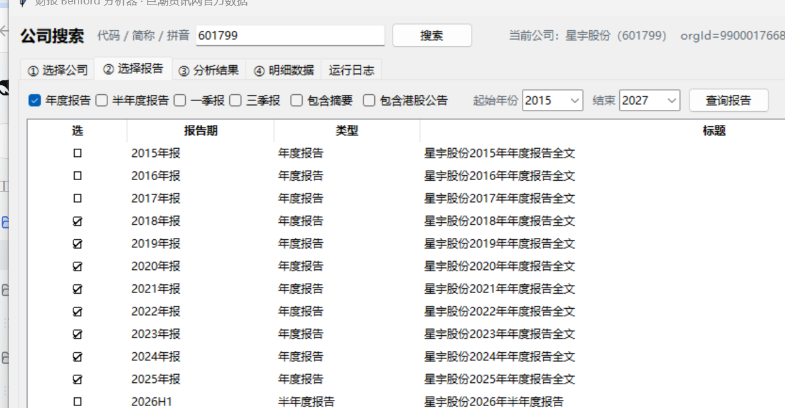
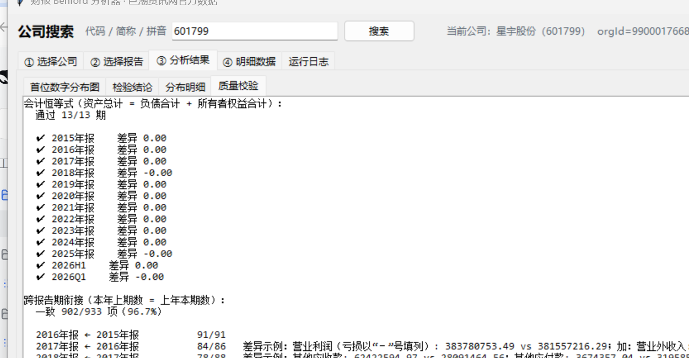
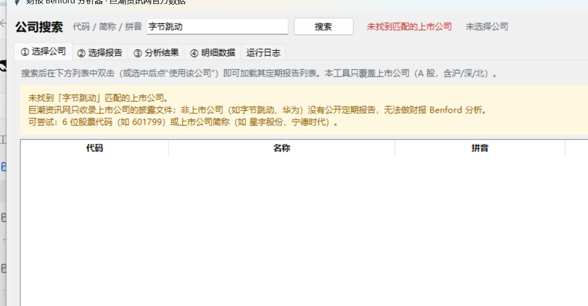

# 财报 Benford 分析器

> 从**官方披露渠道**（巨潮资讯网 cninfo，证监会指定信息披露平台）自动获取 A 股上市公司定期报告，
> 抽取三大合并报表金额，统计首位数字 1–9 的分布，并检验其是否符合 **Benford 对数分布**。

**图形界面** ｜ **命令行** ｜ **可复用 Python 包** ｜ Python 3.10+ ｜ [MIT License](LICENSE)



## 特性

- 🔍 **任意 A 股**：输入代码 / 简称 / 拼音搜索，自动列出该公司全部年报、半年报、一季报、三季报
- 📊 **严谨的检验**：卡方拟合优度、Nigrini MAD 阈值、KS 型统计量，以及不依赖固定阈值的蒙特卡洛 MAD 检验
- 🧮 **多口径稳健性**：本期/期末金额、含同比列、去重唯一值、绝对值阈值、分表、分时段共 9 个数据集
- ✅ **数据质量自证**：会计恒等式（资产 = 负债 + 所有者权益）与跨报告期衔接逐项核对
- 🧩 **版式自适应**：带序号标题、纯数字附注列、章节引用列、表格页被抽成一行等情况都能处理
- ⚡ **快**：pypdfium2 抽取 + 按需 pdfplumber 复核，13 份年报约 30 秒（不含首次下载 PDF）；
  PDF / 文本 / 结果三级缓存，重复分析同一公司只需数秒

## 目录

- [快速开始](#快速开始)
- [界面预览](#界面预览)
- [覆盖范围](#覆盖范围)
- [命令行用法](#命令行用法)
- [作为库调用](#作为库调用)
- [输出说明](#输出说明)
- [示例结论：星宇股份（601799）](#示例结论星宇股份601799)
- [工作原理](#工作原理)
- [目录结构](#目录结构)
- [版式适配与已知坑](#版式适配与已知坑)
- [常见问题](#常见问题)
- [开发与测试](#开发与测试)
- [局限与免责声明](#局限与免责声明)
- [许可证](#许可证)

## 快速开始

### 方式 A：下载现成的可执行文件（免装 Python）

到 [Releases](https://github.com/Carry332/EconomyCheck/releases/latest) 下载：

| 文件 | 说明 |
|---|---|
| `EconomyCheck-v1.0.0-win64-portable.zip` | **便携包（推荐）**：解压即用，启动快，内含 GUI 与 CLI |
| `EconomyCheck-v1.0.0-onefile.zip` | 单文件版：每个程序仅一个 exe，便于单独拷贝（启动需解压到临时目录） |
| `SHA256SUMS.txt` | 压缩包校验和 |

无需安装 Python 与依赖；解压后双击 `EconomyCheck.exe` 即可。需要联网（数据取自巨潮资讯网官方披露）。
未做代码签名，首次运行 SmartScreen 可能提示"未知发布者" → 「更多信息」→「仍要运行」。

### 方式 B：从源码运行

### 1. 安装依赖

依赖装在项目内的 `.pylibs`，不污染全局 Python 环境：

```powershell
$env:PIP_USER="0"
python -m pip install --no-user --target .\.pylibs -r requirements.txt
```

### 2. 启动图形界面

```powershell
.\启动GUI.bat              # 双击亦可，无控制台窗口
python run_gui.py 601799   # 或任意终端启动，并自动搜索该代码
```

### 3. 或直接用命令行

```powershell
python run_cli.py 601799 --kinds annual --last 8    # 最近 8 期年报
python run_cli.py 宁德时代 --from-year 2018          # 支持简称，2018 年至今
python run_cli.py 300750 --kinds annual,semi --out .\out\catl
```

## 界面预览

| ① 选择公司 / ② 选择报告 | ③ 分析结果 |
|---|---|
|  |  |

| 质量校验（恒等式 + 跨期衔接） | 搜索非上市公司时的提示 |
|---|---|
|  |  |

**操作流程**：① 搜索公司 → 双击选中 → ② 勾选报告类型/年份，一键「推荐（近 8 期年报）」→ **▶ 开始分析** →
③ 查看分布图、检验结论、分布明细、质量校验 → ④ 筛选明细数据、导出 CSV / 报告 / 图片。
分析在工作线程中执行，界面不卡顿，随时可「停止」。

## 覆盖范围

数据全部来自**巨潮资讯网 A 股定期报告披露库**：

| 输入示例 | 是否支持 | 说明 |
|---|---|---|
| 星宇股份 / 601799 / 300750 / 833171 | ✅ | 沪市 `6xxxxx`、深市 `0xxxxx`/`3xxxxx`、北交所 `4xxxxx`/`8xxxxx` |
| 字节跳动 / 抖音 / 华为 | ❌ | **非上市公司没有公开定期报告**，界面会明确提示并给出建议 |
| 腾讯 00700 / 阿里巴巴 09988 | ❌ | 港股定期报告在香港交易所披露，不在该库中（界面提示「均非 A 股」） |

## 命令行用法

```
python run_cli.py <代码或简称> [选项]

--kinds annual,semi,q1,q3   报告类型，默认 annual
--from-year / --to-year     年份区间
--last N                    只取最近 N 期
--out DIR                   输出目录（默认 data/<代码>_<简称>）
--include-summary           包含报告摘要（默认排除）
--list-only                 只列出报告，不下载分析
```

退出码：`0` 成功，`1` 有报告未解析出数据，`2` 公司不存在或非 A 股。

## 作为库调用

```python
from echeck import cninfo, pipeline

comp = cninfo.search_companies("601799")[0]          # {'code','name','org_id',...}
reps = cninfo.list_reports(comp["code"], comp["org_id"], ["annual"])
reps = [r for r in reps if not r["is_summary"] and not r["is_hk"]]
reps.sort(key=lambda r: r["period"])                 # 接口默认按公告日期倒序
res = pipeline.run_analysis(comp, reps[-8:])         # 进度/取消回调可选

m = res.main
print(m["n"], f"χ²={m['chi2']:.2f}", f"p={m['p_value']:.3f}", m["verdict"])
print(res.validation["identity_ok"], "/", res.validation["identity_total"])
print(res.paths["results"])                          # 报告/图/CSV 输出目录
```

底层模块也可单独用：`pdftext.extract_text()` → `parse.rows_from_text()` →
`stats.validate()` / `stats.analyze_all()` / `viz.render_figure()`。

## 输出说明

每家公司的工作目录为 `data/<代码>_<简称>/`，其中：

| 路径 | 内容 |
|---|---|
| `pdf/` `txt/` | 官方 PDF 与抽取文本（带缓存版本头，升级解析逻辑后会自动重抽） |
| `results/benford_report.md` | 完整结论：分布明细表、子样本稳健性、校验结果、局限 |
| `results/benford_first_digit.png` | 实际分布 vs Benford 期望对比图 |
| `results/benford_first_digit.csv` | 各数据集 × 首位数字的明细统计 |
| `results/validation.md` | 会计恒等式 + 跨报告期衔接（含差异明细） |
| `results/amounts_raw.csv` | 解析出的全部报表数据行 |
| `results/manifest.json` | 本次分析所用报告的官方下载地址 |

## 示例结论：星宇股份（601799）

数据覆盖 13 期定期报告（2015–2025 年报 + 2026 半年报 + 2026 一季报）的三大合并报表：

| 项目 | 结果 |
|---|---|
| 样本 | 本期/期末金额 **n = 1400**（另有 2715 条含同比列的金额） |
| 卡方检验 | χ² = 7.33，df = 8，**p = 0.502** |
| MAD | 0.0069（Nigrini：可接受） |
| 蒙特卡洛 MAD（2 万次） | p = 0.331 |
| KS 型统计量 | D = 0.0139 < 5% 临界值 0.0363 |
| **结论** | **符合 Benford 对数分布**（9 个首位数字的 \|z\| 均 < 1.96） |

| 首位数字 | 1 | 2 | 3 | 4 | 5 | 6 | 7 | 8 | 9 |
|---|---|---|---|---|---|---|---|---|---|
| 实际占比 | 28.71% | 17.86% | 14.14% | 10.43% | 7.21% | 6.43% | 6.29% | 4.57% | 4.36% |
| Benford 期望 | 30.10% | 17.61% | 12.49% | 9.69% | 7.92% | 6.69% | 5.80% | 5.12% | 4.58% |

数据质量校验：**会计恒等式 13/13 期通过**（差异 0.00），**跨报告期衔接 902/933 项一致（96.7%）**。
差异项逐条核对后确认均为真实重述/重分类，例如 2018 年新金融工具准则将应收利息与应收股利
并入其他应收款、2021 与 2024 年运输费在销售费用与营业成本之间的重分类、每股收益的四舍五入。

<details>
<summary>与早期一次性脚本的差异（点击展开）</summary>

`results/` 是用本工具链复算 13 期报告的输出，与早期脚本 `tools/`（pdfplumber 路径）的结果
差异 ≤0.2%：n = 1400 vs 1402，χ² = 7.33 vs 7.14，结论相同。差异来自两种 PDF 后端对个别
换行的切分方式，不影响结论。

</details>

## 工作原理

```
搜索公司 → 列定期报告 → 下载 PDF → 抽取文本 → 定位三大合并报表 → 抽取金额
        → 数据质量校验 → 首位数字统计与检验 → 出报告/图/CSV
```

1. **搜索公司**：cninfo `topSearch` 接口，返回代码 / 简称 / 拼音 / orgId
2. **列定期报告**：`hisAnnouncement` 接口按类别分页拉取，解析报告期标签（`2025年报`、`2026H1`、`2026Q1`），
   过滤摘要与港股公告，同一期的「正文/全文」只保留全文
3. **下载 PDF**：`static.cninfo.com.cn/finalpage/...`，带重试与缓存
4. **抽取文本**：pypdfium2 为主（比 pdfplumber 快约 40 倍），逐页检测「整页被合并成一行」的表格页，
   只对这些页改用 pdfplumber 重抽
5. **解析报表**：以「标题独占一行 + 随后出现编制单位 / 单位：元」定位合并资产负债表、利润表、现金流量表，
   清洗附注索引列（`七、1`）、章节引用（`第十一节、`）、条目编号（`（2）`）、页码与日期
6. **质量校验**：会计恒等式 + 跨报告期衔接；不达标时自动改用 pdfplumber 整份复核并取更优结果
7. **统计检验**：主口径 + 8 个子样本，卡方 / MAD / KS / 蒙特卡洛，输出报告、CSV 与图

## 目录结构

```
run_gui.py / 启动GUI.bat      图形界面入口（另附「启动GUI-带日志.bat」排障用）
run_cli.py                    命令行入口
echeck/                       工具包
  config.py                   路径与报表标题等常量
  cninfo.py                   cninfo 官方接口：搜索 / 列报告 / 下载
  pdftext.py                  PDF → 文本（含表格页修复与缓存）
  parse.py                    定位三大合并报表并抽取金额
  stats.py                    统计检验 + 数据质量校验 + 报告导出
  viz.py                      Pillow 绘图（不依赖 matplotlib）
  pipeline.py                 端到端编排（进度回调 + 可取消）
  gui.py                      tkinter 界面
data/<代码>_<简称>/            每家公司的工作目录（pdf/ txt/ results/）
raw/                          星宇股份示例的原始 PDF / 文本 / 早期解析结果
results/                      星宇股份示例的分析产物
tools/                        自检、回归与早期一次性脚本
logs/gui.log                  GUI 启动与异常日志
```

## 版式适配与已知坑

各家年报的表格版式差别很大，以下是实测踩到并已处理的情况：

| 现象 | 实例 | 处理方式 |
|---|---|---|
| 报表标题带序号 | 青岛食品 `1、合并资产负债表` | 比对前先去掉行首序号（`1、`/`（一）`/`一、`） |
| 附注列是纯数字 | 贵州茅台 `货币资金 1 51,690,610,946.50` | 识别「纯数字 ≤999 且后面还有带小数金额」的首列是附注号并丢弃 |
| 附注列是章节引用 | 国航远洋 `货币资金 第十一节、 230,739,368.97` | 清洗时一并剔除 `第十一节、` 这类引用 |
| 表格页被抽成一行 | 青岛食品 2025 年报第 62 页 | 逐页检测「疑似合并行」，只对这些页改用 pdfplumber 重抽 |
| 版式仍不理想 | 三表没定位齐 / 每表不足 10 行 / 项目名被污染 | 自动改用 pdfplumber 整份复核并取更优结果（复核标记写入缓存，不重复跑慢路径） |
| 同一期有正文和全文 | `2020年第一季度报告正文`（不含报表） | 列表去重，优先保留「全文」 |
| 项目名跨行断开 | `所有者权益（或股` + `东权益）合计` | 按多种相邻行组合还原，取「像项目名」的那个 |
| 结果不可复现 | 同一 PDF 两次解析结果不同 | 文本统一转 LF 并以 `newline="\n"` 写缓存，杜绝 Windows 换行转换改变行结构 |

## 常见问题

<details>
<summary><b>双击 启动GUI.bat 没反应 / 闪一下就没了</b></summary>

启动脚本会把全过程写入 `logs/gui.log`，失败时还会弹出错误框：

```powershell
Get-Content logs\gui.log -Tail 30
```

| 日志内容 | 原因 | 处理 |
|---|---|---|
| `缺少依赖：pillow, pdfplumber, pypdfium2` | 依赖未装或装到了别处 | 按弹窗提示执行 `pip install --target .\.pylibs ...` |
| `[ERROR] Python 3 not found in PATH` | 未安装 Python 或未加入 PATH | 安装 Python 3 并勾选 Add to PATH |
| 无任何日志 | 启动脚本未被执行 | 改用「启动GUI-带日志.bat」或 `python run_gui.py` 查看报错 |

> 微软商店版 Python 的进程名是 `pythonw3.10` 而不是 `pythonw`，因此启动器不做进程名探测，
> 改由程序自身写日志与弹框。

</details>

<details>
<summary><b>搜索某公司没有反应 / 搜不到</b></summary>

只支持 **A 股上市公司**。非上市公司（字节跳动、华为）与港股（腾讯 00700、阿里 09988）
没有对应的定期报告披露库，界面顶部会显示红色的「未找到匹配的上市公司」并给出原因。

</details>

<details>
<summary><b>提示「没有解析到任何报表数据」</b></summary>

工具会逐期说明原因（未定位到报表 / 疑似扫描件 / 版式不符）并给出建议。常见处理：
确认勾选的是「年度报告全文」而非摘要；换其它报告期；若文本汉字数极少，多为扫描版 PDF，
需要 OCR，本工具暂不支持。

</details>

<details>
<summary><b>结论是「拒绝 Benford」，是不是有问题？</b></summary>

先看样本量。n 小于约 500 时检验结论不稳定，界面会主动提示「样本偏小，建议多勾选几期」。
一般建议至少 6–8 期年报（n ≥ 600）。此外公司规模快速增长会使金额整体上移，
抬高首位 1–2 的占比，这属于正常的规模效应。

</details>

## 开发与测试

```powershell
# GUI 自检：渲染断言
python tools\gui_selftest.py
# 输出界面截图（results/gui/）
python tools\gui_selftest.py --shots
# 联网 + 多线程全流程自检
python tools\gui_selftest.py --online

# 跨公司版式回归（沪/深/北/科创 7 家公司）
python tools\regression_companies.py

# 复算星宇股份交付结果并与工具输出对账
python tools\verify_delivery.py

# 打包 Windows 可执行文件（需先装 pyinstaller：pip install --target .\.pylibs pyinstaller）
python tools\make_icon.py            # 生成 assets/icon.ico
python tools\build_exe.py            # 同时产出便携包与单文件包到 build/release/
python tools\build_exe.py --mode onedir   # 只做便携包（启动快）
```

当前回归结果（每家公司取最新年报）：

```
OK  601799 星宇股份 行数 108 (BS 45/IS 35/CF 28) 恒等式 1/1
OK  001219 青岛食品 行数 114 (BS 48/IS 33/CF 33) 恒等式 1/1
OK  300750 宁德时代 行数 150 (BS 63/IS 48/CF 39) 恒等式 1/1
OK  600519 贵州茅台 行数 126 (BS 52/IS 40/CF 34) 恒等式 1/1
OK  000625 长安汽车 行数 141 (BS 61/IS 44/CF 36) 恒等式 1/1
OK  833171 国航远洋 行数 118 (BS 48/IS 38/CF 32) 恒等式 1/1
OK  688981 中芯国际 行数 156 (BS 47/IS 41/CF 68) 恒等式 1/1
```

## 局限与免责声明

- 卡方检验假设样本独立，而同一报表内各科目存在会计勾稽关系，p 值应视为参考而非严格推断
- 样本量偏小、公司规模快速变化、行业特性都会影响首位数字分布，结论需要结合具体业务判断
- Benford 检验只能说明「数字分布是否自然」，**不能单独证明或排除财务舞弊**
- 数据来自公开披露文件，解析结果可能存在误差，**不构成任何投资建议**；请以官方披露原文为准

## 许可证

[MIT License](LICENSE) © 2026 Carry
